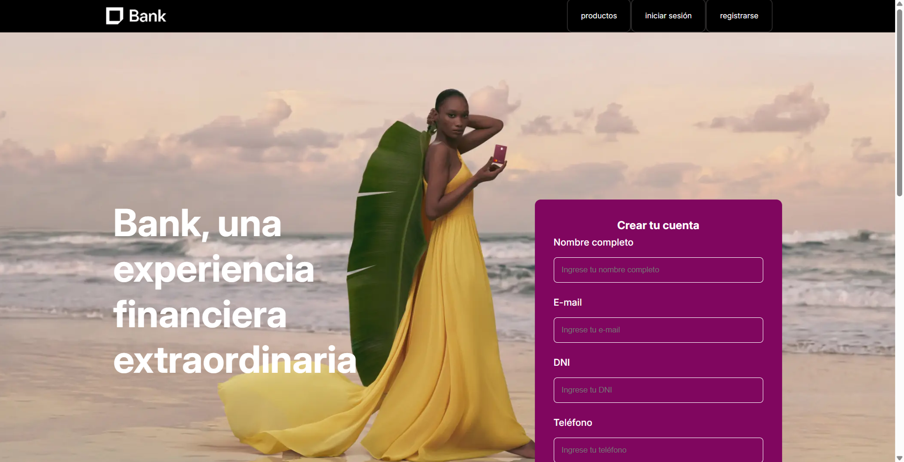

# Bank — Migración de HTML/CSS a React

[](https://danielgranato.github.io/utn-frontend-react-migration/)

Landing page de un producto fintech ficticio ("Bank"), migrada de un proyecto estático en HTML + CSS hacia una aplicación React componentizada, con estado, formularios controlados y ruteo client-side.


🔗 **Demo (versión React):** https://danielgranato.github.io/utn-frontend-react-migration/
🔗 **Demo (versión original HTML/CSS):** https://danielgranato.github.io/utn-frontend/

## Contexto académico

Este proyecto es el **Trabajo Práctico Final del módulo de Front-End** de la carrera Full Stack de la **UTN**. La consigna proponía dos caminos: crear un proyecto React nuevo con consumo de API, o migrar un proyecto ya existente del curso a React reforzando estado, formularios controlados y ruteo. Se optó por la segunda opción para poder mostrar la evolución de un mismo proyecto a lo largo del curso, en vez de partir de cero.

## De HTML/CSS a React: qué cambió

El proyecto original era un sitio estático de 4 páginas (`index.html`, `login.html`, `productos.html`, `registro.html`), cada una con su propio `<head>`, con el header/nav/footer duplicados en cada archivo, y con el menú hamburguesa resuelto con el truco de `<input type="checkbox">` + CSS (sin JavaScript).

En la migración a React:

- El header y el footer, antes copiados y pegados en cada archivo `.html`, pasaron a ser componentes únicos (`Header`, `Footer`) reutilizados vía un `Layout` compartido con React Router.
- El menú hamburguesa dejó el "checkbox hack" y pasa a manejarse con estado real (`useState`, encapsulado en el hook `useMenu`), cerrándose automáticamente al cambiar de ruta.
- La grilla de productos, antes 6 bloques de HTML repetidos, se volvió un único componente `Card` reutilizable, alimentado por un array de datos.
- La navegación entre páginas, antes hecha con recargas de página completas (`<a href="...">`), ahora es client-side con React Router, sin recargar el navegador.
- Los formularios (login, registro, newsletter) dejaron de ser HTML "mudo" y pasaron a ser formularios controlados con `useState`, con validación, feedback visual y eventos logueados en consola.
- El diseño visual original (CSS, tipografía, paleta de colores) se mantuvo intacto — el objetivo de la migración era la arquitectura, no rediseñar el sitio.

## Tecnologías utilizadas

- **React 19**
- **Vite 7** como bundler y servidor de desarrollo
- **React Router DOM v7** para el ruteo
- **CSS puro**, organizado por componente/página (sin frameworks de estilos)
- **GitHub Pages** para el deploy

## Conceptos de React aplicados

- Componentización y composición (`Header`, `Footer`, `Layout`, `Card`, `SocialIcons`, `Contact`)
- Props, incluyendo un componente `Card` con variantes (`product` / `cta`)
- Hooks: `useState`, `useEffect`, `useCallback`, y un hook personalizado (`useMenu`)
- Formularios controlados, con `onChange`, `onSubmit`, reseteo de estado y eventos mostrados en consola
- Ruteo client-side con `react-router-dom` (`Routes`, `Route`, `Link`, `Outlet`, `useLocation`, `useSearchParams`, `useNavigate`)
- Reutilización de assets e imágenes importadas como módulos de Vite

## Estructura de carpetas

```
src/
  components/   → Header, Footer, Layout, Card, SocialIcons, Contact
  pages/        → Home, Login, Productos, Registro
  hooks/        → useMenu
  css/          → estilos organizados por componente/página
  assets/       → imágenes del sitio
```

## Cómo correr el proyecto localmente

```bash
npm install
npm run dev
```

Para generar el build de producción:

```bash
npm run build
npm run preview
```

## Deploy

El sitio está desplegado en GitHub Pages bajo la ruta `/utn-frontend-react-migration/`, por lo que `vite.config.js` define `base` y `main.jsx` define el `basename` del `BrowserRouter` acordes a esa ruta.
